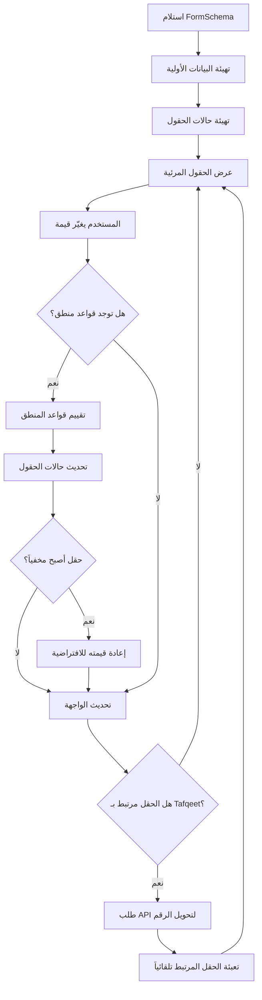

# 🖥 دليل عرض الحقول وتفسير النموذج (Form Renderer Guide)

## نظرة عامة

هذا الدليل يشرح بالتفصيل **كيف يعمل مُفسّر النماذج (Form Renderer)** — الخوارزمية الكاملة من لحظة استلام المخطط (Schema) وحتى عرض الحقول على الشاشة والتفاعل معها.

الهدف هو تمكين أي مبرمج آخر من بناء نماذج متوافقة مع هذا المُفسّر دون الحاجة لقراءة الكود المصدري.

---

## 1. خط سير العرض الكامل (Rendering Pipeline)



---

## 2. المرحلة الأولى: تهيئة البيانات (`Initialization`)

عند تحميل النموذج لأول مرة، تحدث عمليتان رئيسيتان:

### 2.1 تهيئة بيانات الحقول (`formData`)

```
لكل حقل (field) في schema.fields:
    formData[field.name] = initialData[field.name]   ← إذا وُجدت بيانات سابقة
                        ?? field.defaultValue         ← أو القيمة الافتراضية
                        ?? ''                         ← أو نص فارغ
```

**النتيجة:** كائن `Record<string, any>` مثل:
```json
{
    "employee_name": "",
    "amount": "",
    "leave_type": "",
    "agree_terms": ""
}
```

### 2.2 تهيئة حالات الحقول (`fieldStates`)

```
لكل حقل (field) في schema.fields:
    
    // حساب الرؤية الأولية
    إذا field.initialVisibility === 'hidden' → visible = false
    إذا field.initialVisibility === 'visible' → visible = true
    وإلا → visible = (field.hidden !== true)  // الافتراضي: مرئي
    
    // حساب التفعيل الأولي
    إذا field.initialEnabled === 'disabled' → enabled = false
    إذا field.initialEnabled === 'enabled' → enabled = true
    وإلا → enabled = (field.disabled !== true)  // الافتراضي: مفعّل
    
    fieldStates[field.name] = { visible, enabled }
```

**النتيجة:** كائن `Record<string, { visible: boolean, enabled: boolean }>` مثل:
```json
{
    "employee_name": { "visible": true, "enabled": true },
    "urgent_reason": { "visible": false, "enabled": true },
    "locked_field": { "visible": true, "enabled": false }
}
```

> **أولوية التحديد:**
> 1. `initialVisibility` / `initialEnabled` (الأعلى أولوية)
> 2. `hidden` / `disabled` (بديل قديم)
> 3. الافتراضي: `visible: true` و `enabled: true`

---

## 3. المرحلة الثانية: عرض الحقول (`Rendering`)

### 3.1 فلترة الحقول المرئية

```
الحقول المعروضة = schema.fields.filter(field => 
    fieldStates[field.name].visible !== false
)
```

فقط الحقول التي حالتها `visible: true` يتم عرضها. الحقول المخفية **لا تُعرض على الإطلاق** في DOM.

### 3.2 تحديد التمكين

```
لكل حقل مرئي:
    isEnabled = fieldStates[field.name].enabled !== false
                AND field.readOnly !== true

    // الحقل يكون معطلاً إذا:
    // - حالته disabled
    // - أو readOnly: true
    // - أو النموذج في وضع القراءة فقط (readOnly prop)
```

### 3.3 تحديد العرض (Grid)

```
colSpan = field.layout?.colSpan || 12   // الافتراضي: عرض كامل

تحويل colSpan إلى CSS class:
    12 → 'md:col-span-12'  (100%)
    6  → 'md:col-span-6'   (50%)
    4  → 'md:col-span-4'   (33%)
    3  → 'md:col-span-3'   (25%)
    أي قيمة أخرى → 'md:col-span-12'
```

> الشبكة الأساسية هي `grid grid-cols-12 gap-x-6 gap-y-4`. على الشاشات الصغيرة كل حقل يأخذ `col-span-12`.

### 3.4 أنواع الحقول المدعومة (Field Components)

بناءً على `field.type.toLowerCase()`، يتم توجيه الحقل للمكون المناسب:

| النوع (Type) | المكوّن (Component) | الوصف |
| :--- | :--- | :--- |
| `text` | `TextField` | حقل نصي بسطر واحد |
| `email` | `TextField` | حقل مخصص للبريد الإلكتروني (مع تحقق تلقائي) |
| `password` | `TextField` | حقل كلمة مرور (مخفي) |
| `number` | `TextField` | حقل للأرقام فقط |
| `textarea` | `TextareaField` | حقل نصي مطول متعدد الأسطر |
| `select` | `SelectField` | قائمة منسدلة (Static أو LookUp) |
| `radio` | `RadioField` | أزرار اختيار دائرية (خيار واحد فقط) |
| `checkbox` | `CheckboxField` | مربع اختيار (خيار واحد أو مصفوفة خيارات) |
| `date` | `DateField` | حقل لاختيار التاريخ |

### 3.5 تفاصيل وخصائص كل نوع (Field Properties)

لكل نوع حقل خصائص إضافية يمكن تعريفها في الـ Schema:

#### 1. الحقول النصية والرقمية (`text`, `number`, `email`, `password`)
*   **`placeholder`**: النص المؤقت داخل الحقل.
*   **`defaultValue`**: القيمة الأولية عند تحميل النموذج.
*   **`numberSpelling`**: (للحقول التي تعرض التفقيط) تحتوي على `sourceField` الذي يشير لاسم الحقل الرقمي المصدر.

#### 2. النص المطول (`textarea`)
*   **`rows`**: عدد الأسطر الافتراضي (مثلاً: `4`).

#### 3. القوائم (Select) والاختيارات (Radio/Checkbox)
*   **`dataSource`**: يحدد مصدر البيانات:
    *   `type: 'static'`: يتطلب مصفوفة `options` تحتوي على `{ label, value }`.
    *   `type: 'lookup'`: يتطلب `lookUpFieldId` لجلب البيانات من النظام.
*   **`direction`**: (لـ Radio و Checkbox) يحدد اتجاه العرض: `'horizontal'` أو `'vertical'`.

#### 4. الحقل المسمّى (Label / Header Only)
*   **`type: 'label'`**: حقل للعرض فقط، يستخدم لعرض نصوص توضيحية أو عناوين فرعية داخل النموذج ولا يقبل إدخال بيانات.

---

## 4. المرحلة الثالثة: محرك المنطق الشرطي (`Logic Engine`)

يتم تشغيل محرك المنطق **عند كل تغيير** في أي حقل.

### 4.1 خوارزمية التقييم

```
الدخل: rules[], formData, allFields

1. بناء حالات أولية نظيفة (من تعريفات الحقول الأصلية)
   // هذا يعني أن كل تقييم يبدأ من الصفر، وليس تراكمياً

2. لكل قاعدة (rule) في rules:
    a. تقييم الشرط: evaluateCondition(rule.when, formData)
    
    b. إذا تحقق الشرط:
        لكل إجراء (action) في rule.actions:
            بناءً على action.effect:
                'show'      → targetField.visible = true
                'hide'      → targetField.visible = false
                'enable'    → targetField.enabled = true
                'disable'   → targetField.enabled = false
                'require'   → targetField.required = true
                'unrequire' → targetField.required = false

3. إرجاع الحالات الجديدة
```

> [!IMPORTANT]
> **نقطة حرجة:** التقييم يبدأ **دائماً من الحالة الأولية** للحقول (وليس من الحالة السابقة). هذا يعني:
> - إذا لم يتحقق الشرط، يظل الحقل في حالته **الأولية** (المعرّفة في `initialVisibility`/`initialEnabled`).
> - لا يوجد "تذكّر" لتأثيرات سابقة.

### 4.2 تقييم الشروط

```
evaluateCondition(condition, formData):
    fieldValue = formData[condition.field]
    
    switch (condition.operator):
        'equals'             → fieldValue == value            // مقارنة مرنة
        'notEquals'          → fieldValue != value
        'contains'           → fieldValue.includes(value)     // نصي
        'greaterThan'        → Number(fieldValue) > Number(value)
        'lessThan'           → Number(fieldValue) < Number(value)
        'greaterThanOrEqual' → Number(fieldValue) >= Number(value)
        'lessThanOrEqual'    → Number(fieldValue) <= Number(value)
        'startsWith'         → fieldValue.startsWith(value)   // نصي
        'endsWith'           → fieldValue.endsWith(value)     // نصي
```

> **ملاحظات:**
> - `equals` تستخدم `==` (مقارنة مرنة) وليس `===`. لذلك `"5" == 5` تعطي `true`.
> - `contains`/`startsWith`/`endsWith` تعمل فقط إذا كانت القيمة من نوع `string`.

### 4.3 معالجة الحقول المخفية

عندما يتم إخفاء حقل بواسطة قاعدة منطقية، يتم **تلقائياً** إعادة قيمته:

```
لكل حقل:
    إذا (كان مرئياً سابقاً) AND (أصبح مخفياً الآن):
        formData[field.name] = field.defaultValue ?? ''
```

هذا يضمن أن البيانات المُرسلة لا تحتوي على قيم حقول مخفية.

---

## 5. المرحلة الرابعة: التحقق (`Validation`)

يتم التحقق **فقط عند محاولة الإرسال** (Submit).

### 5.1 خوارزمية التحقق

```
validateForm(fields, formData, fieldStates):
    errors = {}
    
    لكل حقل:
        // ✅ التحقق يتم فقط على الحقول المرئية
        إذا fieldStates[field.name].visible === false → تخطّي
        
        // تحديد ما إذا كان الحقل مطلوباً
        isRequired = field.validation يحتوي 'required'
                  OR fieldStates[field.name].required === true  // من قواعد المنطق
        
        // التحقق من القيمة
        error = validateField(field, formData[field.name], isRequired)
        
        إذا error → errors[field.name] = error
    
    إرجاع errors
```

### 5.2 أنواع التحقق المتاحة (Validation Rules)

يحتوي كل حقل على مصفوفة `validation` تتكون من كائنات `{ rule: string, value?: any, message?: string }`.

| القاعدة (Rule) | القيمة (Value) | الوصف | مثال |
| :--- | :--- | :--- | :--- |
| **`required`** | لا يوجد | الحقل إلزامي ولا يمكن تركه فارغاً | `{ "rule": "required" }` |
| **`minLength`** | `number` | الحد الأدنى لعدد الحروف المدخلة (للنصوص) | `{ "rule": "minLength", "value": 3 }` |
| **`maxLength`** | `number` | الحد الأقصى لعدد الحروف المدخلة (للنصوص) | `{ "rule": "maxLength", "value": 100 }` |
| **`minValue`** | `number` | أقل قيمة عددية مسموح بها (للأرقام) | `{ "rule": "minValue", "value": 1 }` |
| **`maxValue`** | `number` | أكبر قيمة عددية مسموح بها (للأرقام) | `{ "rule": "maxValue", "value": 1000 }` |
| **`pattern`** | `string` | تعبير نمطي (Regex) للتحقق من تنسيق خاص | `{ "rule": "pattern", "value": "^[0-9]{10}$" }` |

### 5.3 آلية التحقق البرمجية

```
validateField(field, value, isRequired):
    isEmpty = value === null || undefined || value.toString().trim() === ''
    
    1. إذا isRequired AND isEmpty:
       → إرجاع "field.label مطلوب" (أو رسالة مخصصة)
    
    2. إذا !isEmpty (الحقل له قيمة):
       لكل قاعدة في field.validation:
       
           'minLength': إذا value.length < rule.value → خطأ
           'maxLength': إذا value.length > rule.value → خطأ
           'minValue':  إذا Number(value) < rule.value → خطأ
           'maxValue':  إذا Number(value) > rule.value → خطأ
           'pattern':   إذا !RegExp(rule.value).test(value) → خطأ
    
    3. إرجاع null (بدون أخطاء)
```

> [!TIP]
> **رسائل الخطأ المخصصة:** إذا تم تزويد خاصية `message` في قاعدة التحقق، فسيتم عرضها بدلاً من الرسالة الافتراضية المولدة ذاتياً.

> **ملاحظات:**
> - قواعد `minLength`/`maxLength` تعمل فقط مع القيم النصية.
> - قواعد `minValue`/`maxValue` تحوّل القيمة إلى رقم.
> - قاعدة `pattern` تقبل أي تعبير نظامي (Regex) كـ string.

---

## 6. خاصية تحويل الأرقام إلى نص (Tafqeet)

### 6.1 آلية العمل

```
عند تغيير قيمة حقل (fieldName):
    
    1. البحث عن حقول مرتبطة:
       dependentFields = schema.fields.filter(f => 
           f.numberSpelling?.sourceField === fieldName
       )
    
    2. إذا وُجدت حقول مرتبطة:
       a. تحويل القيمة إلى رقم
       b. إذا كانت القيمة رقماً صالحاً:
          - انتظار 600ms (Debounce) لتقليل الطلبات
          - إرسال طلب API لتحويل الرقم
          - تعبئة جميع الحقول المرتبطة بالنتيجة
       c. إذا كانت القيمة غير رقمية:
          - تفريغ جميع الحقول المرتبطة
```

### 6.2 واجهة API

```
GET /api/Utils/NumberSearchSpelling?number=12345
Response: "اثنا عشر ألفاً وثلاثمائة وخمسة وأربعون"
```

---

## 7. عرض البيانات المحفوظة (Response Evaluator)

عند **عرض بيانات نموذج تم إرساله مسبقاً** (للقراءة فقط)، يتم استخدام خوارزمية خاصة:

### 7.1 تقييم الاستجابة

```
evaluateFormResponse(response):
    schema = response.schema    // المخطط المحفوظ وقت الإرسال
    data = response.data        // البيانات المُدخلة

    1. حساب حالات الحقول الأولية (نفس خوارزمية التهيئة)
    2. تطبيق قواعد المنطق بناءً على البيانات المحفوظة
    3. لكل حقل → حساب القيمة المعروضة (displayValue)
    4. إرجاع فقط الحقول المرئية
```

### 7.2 تحويل القيم للعرض

```
getDisplayValue(field, value):
    إذا value فارغ → '-'
    
    إذا field.type === 'checkbox':
        إذا Array → value.join(' ، ')
        إذا boolean → 'نعم' أو 'لا'
    
    إذا field.type === 'select' أو 'radio':
        بحث في field.dataSource.options عن label مطابق
        إذا وُجد → إرجاع label
        إذا lookUp → إرجاع القيمة كما هي (لأن القيمة المخزنة هي desc)
    
    إذا field.type === 'date':
        محاولة تحويل إلى تاريخ عربي → toLocaleDateString('ar-EG')
    
    الافتراضي → String(value)
```

> [!IMPORTANT]
> **لماذا يتم حفظ الـ Schema مع كل Response؟**
> - لأن مالك النموذج قد يُعدّل الحقول لاحقاً (يضيف/يحذف/يغيّر).
> - عند عرض بيانات قديمة، يجب استخدام المخطط الذي كان موجوداً **وقت الإرسال** لضمان العرض الصحيح.

---

## 8. ملخص تدفق البيانات الكامل

```mermaid
flowchart LR
    subgraph "إنشاء النموذج"
        A["FormEditor"] -->|حفظ| B["Template في DB"]
        B -->|contentAsJson| C["FormSchema JSON"]
    end
    
    subgraph "تعبئة النموذج"
        C -->|قراءة| D["FormRenderer"]
        D -->|عرض| E["حقول تفاعلية"]
        E -->|تعبئة| F["formData"]
        F -->|إرسال| G["Request في DB"]
        G -->|Content + Schema| H["بيانات محفوظة"]
    end
    
    subgraph "عرض البيانات"
        H -->|قراءة| I["Response Evaluator"]
        I -->|تقييم المنطق| J["حقول مرئية فقط"]
        J -->|تحويل القيم| K["عرض للقراءة"]
    end
```



---

## 9. التوافق: ما الذي يجب أن يلتزم به المبرمج الآخر؟

لضمان التوافق الكامل مع المُفسّر الحالي، يجب الالتزام بالقواعد التالية:

### ✅ قواعد إلزامية

| القاعدة | التفاصيل |
|---------|---------|
| **هيكل الـ Schema** | يجب أن يطابق `FormSchema` تماماً |
| **أسماء الحقول** | يجب أن تكون فريدة ومتسقة بين `fields` و `logic` |
| **أنواع الحقول** | فقط الأنواع المدعومة: `text`, `email`, `password`, `number`, `textarea`, `select`, `radio`, `checkbox`, `date` |
| **مصادر البيانات** | `static` مع `options` أو `lookup` مع `lookUpFieldId` |
| **قواعد المنطق** | `when.field` و `actions.targetField` يستخدمان `name` |
| **القيم المخزّنة** | `Content` في Request يجب أن يكون JSON string لـ `{ fieldName: value }` |
| **الـ colSpan** | فقط القيم `3`, `4`, `6`, `12` مدعومة |

### ⚠️ أخطاء شائعة يجب تجنبها

| الخطأ | الصحيح |
|-------|--------|
| استخدام `id` في قواعد المنطق | استخدام `name` |
| `"type": "Select"` بحرف كبير | المُفسّر يدعمها (toLowerCase) لكن يُفضّل `"select"` |
| `"colSpan": 5` | غير مدعوم؛ استخدم `3`, `4`, `6`, أو `12` |
| `contentAsJson` ككائن JSON | يجب أن يكون **سلسلة نصية مُرمّزة** |
| حفظ `id` كقيمة لـ LookUp | المُفسّر يحفظ `desc` (النص) وليس `id` |

### 🔗 نقاط التكامل مع API

```
إنشاء قالب:   POST   /api/Templates        { contentAsJson, templateName }
تحديث قالب:   PUT    /api/Templates/{id}    { contentAsJson, templateName }
جلب القوالب:  GET    /api/Templates
جلب قالب:     GET    /api/Templates/{id}

إرسال طلب:    POST   /api/Requests          (multipart/form-data)
جلب الطلبات:  GET    /api/Requests

إرسال رد:     POST   /api/Responses         (multipart/form-data)
جلب الردود:   GET    /api/Responses
```

---

## 10. مثال عملي: بناء نموذج متوافق من الصفر

```json
{
    "id": "new-uuid-here",
    "title": "نموذج طلب شراء",
    "fields": [
        {
            "id": "uuid-1",
            "name": "item_name",
            "type": "text",
            "label": "اسم الصنف",
            "validation": [{ "rule": "required" }],
            "layout": { "colSpan": 6 }
        },
        {
            "id": "uuid-2",
            "name": "quantity",
            "type": "number",
            "label": "الكمية",
            "validation": [
                { "rule": "required" },
                { "rule": "minValue", "value": 1 }
            ],
            "layout": { "colSpan": 3 }
        },
        {
            "id": "uuid-3",
            "name": "unit_price",
            "type": "number",
            "label": "سعر الوحدة",
            "layout": { "colSpan": 3 }
        },
        {
            "id": "uuid-4",
            "name": "priority",
            "type": "radio",
            "label": "الأولوية",
            "direction": "horizontal",
            "dataSource": {
                "type": "static",
                "options": [
                    { "label": "عادي", "value": "normal" },
                    { "label": "عاجل", "value": "urgent" },
                    { "label": "طارئ", "value": "critical" }
                ]
            },
            "layout": { "colSpan": 6 }
        },
        {
            "id": "uuid-5",
            "name": "justification",
            "type": "textarea",
            "label": "مبررات الشراء العاجل",
            "initialVisibility": "hidden",
            "rows": 4
        }
    ],
    "logic": [
        {
            "when": {
                "field": "priority",
                "operator": "equals",
                "value": "urgent"
            },
            "actions": [
                { "targetField": "justification", "effect": "show" },
                { "targetField": "justification", "effect": "require" }
            ]
        },
        {
            "when": {
                "field": "priority",
                "operator": "equals",
                "value": "critical"
            },
            "actions": [
                { "targetField": "justification", "effect": "show" },
                { "targetField": "justification", "effect": "require" }
            ]
        }
    ]
}
```

**هذا النموذج سيُعرض كالتالي:**
1. صف أول: `اسم الصنف` (50%) + `الكمية` (25%) + `سعر الوحدة` (25%)
2. صف ثاني: `الأولوية` (50%) — أزرار أفقية
3. عند اختيار "عاجل" أو "طارئ" → يظهر حقل `مبررات الشراء العاجل` (100%) ويصبح مطلوباً
