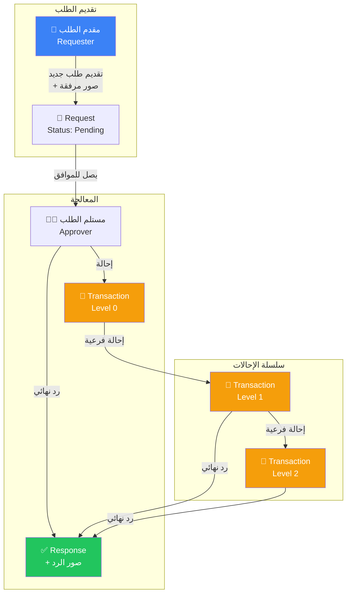
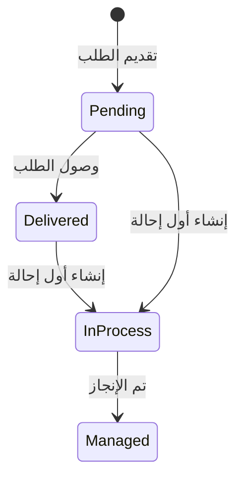
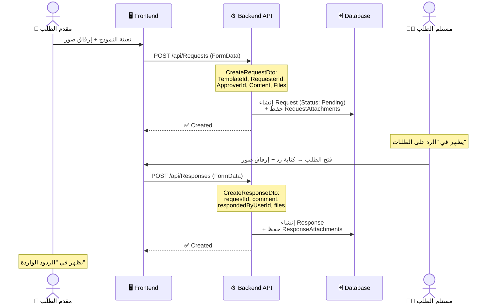
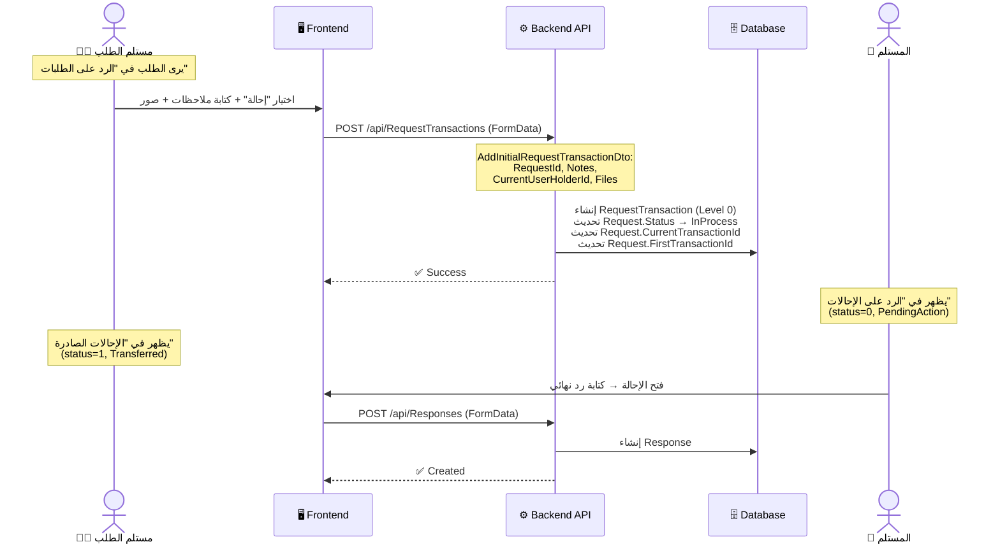
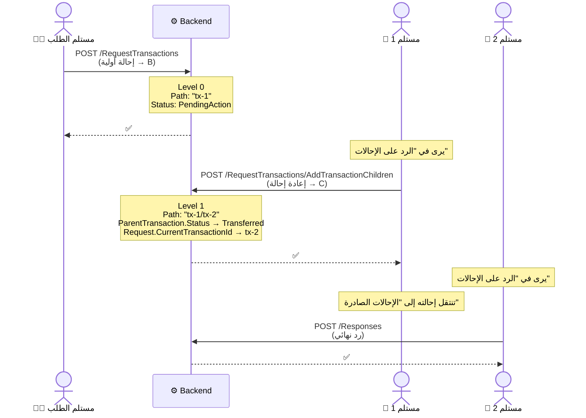
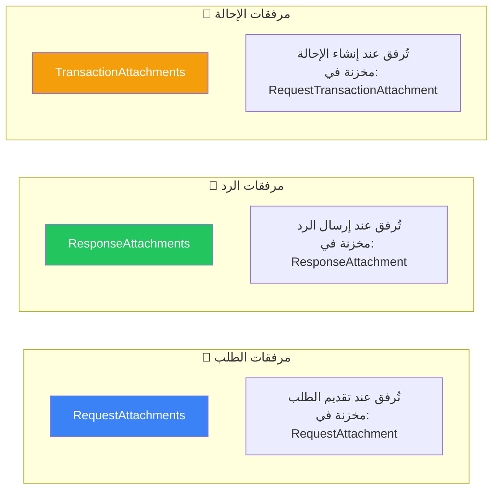
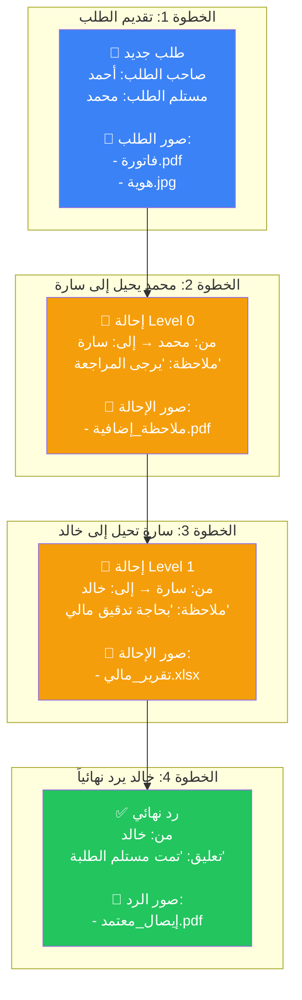

# دورة حياة الطلب في ModernPaySystem

## نظرة عامة على النظام | System Overview

يدير النظام دورة حياة كاملة للطلبات بدءاً من التقديم وحتى الرد النهائي أو الإحالة المتعددة.



---

## الكيانات الأساسية | Core Entities

### 1. Request (الطلب)

> [!NOTE]
> ملف الكيان: [Request.cs](file:///c:/Users/DELL/Desktop/ModernPaySystem/ModernPaySystem.Domain/Entities/TransactionSystemEntities/Request.cs)

| الحقل | النوع | الوصف |
|-------|------|------|
| `Id` | `Guid` | المعرف الفريد |
| `TemplateId` | `Guid` | النموذج المصدر |
| `RequesterId` | `Guid` | مقدم الطلب |
| `ApproverId` | `Guid` | مستلم الطلب/المسؤول |
| `ContentAsJson` | `string` | بيانات النموذج (JSON) |
| `Status` | `RequestStatus` | حالة الطلب |
| `ResponseId` | `Guid?` | الرد المرتبط (إن وجد) |
| `FirstTransactionId` | `Guid?` | أول إحالة |
| `CurrentTransactionId` | `Guid?` | الإحالة الحالية النشطة |
| `RequestAttachments` | `Collection` | المرفقات عند التقديم |
| `ReadOnlyUsers` | `Collection<User>` | مستخدمون بصلاحية قراءة فقط |

#### حالات الطلب (`RequestStatus`):



| القيمة | الحالة | الوصف |
|-------|------|------|
| `0` | `Pending` | قُدم الطلب ولم يصل بعد |
| `1` | `Delivered` | وصل للموافق |
| `2` | `InProcess` | أُنشئت إحالة (Transaction) |
| `3` | `Managed` | تم الانتهاء من المعالجة |

### 2. Response (الرد)

> [!NOTE]
> ملف الكيان: [ResponsesController.cs](file:///c:/Users/DELL/Desktop/ModernPaySystem/ModernPaySystem/Controllers/ResponsesController.cs)

| الحقل | النوع | الوصف |
|-------|------|------|
| `Id` | `Guid` | المعرف الفريد |
| `RequestId` | `Guid` | الطلب المرتبط |
| `RespondedByUserId` | `Guid` | المستخدم الذي أرسل الرد |
| `Comment` | `string?` | نص الرد |
| `ResponseAttachments` | `Collection` | صور/ملفات مرفقة مع الرد |

### 3. RequestTransaction (الإحالة)

> [!NOTE]
> ملف الكيان: [RequestTransaction.cs](file:///c:/Users/DELL/Desktop/ModernPaySystem/ModernPaySystem.Domain/Entities/TransactionSystemEntities/RequestTransaction.cs)

| الحقل | النوع | الوصف |
|-------|------|------|
| `Id` | `Guid` | المعرف الفريد |
| `RequestId` | `Guid` | الطلب المرتبط |
| `Notes` | `string` | ملاحظات الإحالة |
| `Level` | `int` | مستوى العمق (0 = جذر) |
| `Path` | `string` | المسار الكامل (e.g., `id1/id2/id3`) |
| `ParentTransactionId` | `Guid?` | الإحالة الأب |
| `CurrentUserHolderId` | `Guid` | المستخدم المستلم الحالي |
| `Status` | `TransactionStatus` | حالة الإحالة |
| `ChildTransactions` | `Collection` | الإحالات الفرعية |
| `RequestTransactionAttachments` | `Collection` | صور/ملفات مرفقة مع الإحالة |

#### حالات الإحالة (`TransactionStatus`):

| القيمة | الحالة | الوصف |
|-------|------|------|
| `0` | `PendingAction` | بانتظار إجراء من المستلم |
| `1` | `Transferred` | تمت إعادة الإحالة لشخص آخر |

---

## تدفق العمل الكامل | Complete Workflow

### السيناريو 1: رد مباشر (بدون إحالة)



### السيناريو 2: إحالة أولية ثم رد



### السيناريو 3: إحالة متعددة المستويات



---

## صفحات الـ Sidebar | Sidebar Pages

> [!IMPORTANT]
> ملف تعريف عناصر الملاحة: [navigation.tsx](file:///c:/Users/DELL/Desktop/ModernPaySystem/ModernPaySystem.Front/src/shared/config/navigation.tsx)

### خريطة الصفحات

| # | العنوان في Sidebar | المسار | الملف | مصدر البيانات (API) |
|---|-------------------|-------|-------|-------------------|
| 1 | **الرد على الطلبات** | `/form-builder/responses` | [responses-page.tsx](file:///c:/Users/DELL/Desktop/ModernPaySystem/ModernPaySystem.Front/src/pages/form-builder/responses-page.tsx) | `GET /Requests/GetPagedRequestsNeedAction/false` |
| 2 | **الردود الواردة** | `/form-builder/my-responses` | [my-responses-page.tsx](file:///c:/Users/DELL/Desktop/ModernPaySystem/ModernPaySystem.Front/src/pages/form-builder/my-responses-page.tsx) | `GET /Responses/by-requester/{requesterId}` |
| 3 | **الردود الصادرة** | `/form-builder/actioned` | [actioned-requests-page.tsx](file:///c:/Users/DELL/Desktop/ModernPaySystem/ModernPaySystem.Front/src/pages/form-builder/actioned-requests-page.tsx) | `GET /Requests/GetPagedRequestsNeedAction/true` |
| 4 | **الرد على الإحالات** | `/form-builder/referrals/pending` | [referrals-page.tsx](file:///c:/Users/DELL/Desktop/ModernPaySystem/ModernPaySystem.Front/src/pages/form-builder/referrals-page.tsx) (`status=0`) | `GET /RequestTransactions?status=0` |
| 5 | **الإحالات الصادرة** | `/form-builder/referrals/sent` | [referrals-page.tsx](file:///c:/Users/DELL/Desktop/ModernPaySystem/ModernPaySystem.Front/src/pages/form-builder/referrals-page.tsx) (`status=1`) | `GET /RequestTransactions?status=1` |

### 1. الرد على الطلبات (`/form-builder/responses`)

**الغرض:** عرض الطلبات التي وصلت للمستخدم الحالي (بصفته مستلم الطلب `Approver`) ولم يتم الرد عليها بعد.

**مصدر البيانات:**
```
GET /api/Requests/GetPagedRequestsNeedAction/false?page=1&pageSize=15
```

**المنطق:**
- [useResponsePageLogic.ts](file:///c:/Users/DELL/Desktop/ModernPaySystem/ModernPaySystem.Front/src/features/form-builder/model/useResponsePageLogic.ts) — يدير حالة الصفحة
- يجلب الطلبات التي `hasResponse = false` (لم يتم الرد عليها)
- يوفر خيارين عند الضغط على الطلب:
  - **رد مباشر** → `POST /api/Responses`
  - **إحالة الطلب** → `POST /api/RequestTransactions` أو `POST /api/RequestTransactions/AddTransactionChildren`

**ما يُعرض:**
- بيانات النموذج (`RequestFieldsPreview`)
- صور/مرفقات الطلب الأصلي (`requestAttachmentDtos`)
- اسم مقدم الطلب
- خيار إرسال رد أو إحالة مع إرفاق صور جديدة

---

### 2. الردود الواردة (`/form-builder/my-responses`)

**الغرض:** عرض الردود التي وصلت لمقدم الطلب (بصفته `Requester`) على طلباته.

**مصدر البيانات:**
```
GET /api/Responses/by-requester/{currentUserId}?page=1&pageSize=10
```

**ما يُعرض:**
- اسم النموذج، محتوى الطلب
- اسم مستلم الطلب الذي أرسل الرد
- تاريخ الرد
- عند الضغط "عرض الرد" → يفتح `ResponseDetailsModal` الذي يعرض:
  - بيانات الطلب + صور الطلب
  - نص الرد + صور الرد (`responseAttachments`)

---

### 3. الردود الصادرة (`/form-builder/actioned`)

**الغرض:** أرشيف الطلبات التي قام المستخدم الحالي بالرد عليها مسبقاً.

**مصدر البيانات:**
```
GET /api/Requests/GetPagedRequestsNeedAction/true?page=1&pageSize=10
```

**ما يُعرض:**
- قائمة الطلبات التي تم الرد عليها (`hasResponse = true`)
- عرض التفاصيل عبر `ResponseDetailsModal`

---

### 4. الرد على الإحالات (`/form-builder/referrals/pending`)

**الغرض:** عرض الإحالات التي وصلت للمستخدم الحالي وتنتظر إجراءً منه.

**مصدر البيانات:**
```
GET /api/RequestTransactions?status=0&page=1&pageSize=10
```

**كيف يعمل الفلتر على الـ Backend:**
```csharp
// RequestTransactionService.GetPagedAsync
filters.Add(RequestTransactionExpressions.CanReadByUserId(currentUserId));
filters.Add(rt => rt.Status == TransactionStatus.PendingAction); // status=0
```

**ما يُعرض:**
- ملاحظات الإحالة (`referral.notes`)
- بيانات الطلب الأصلي (`referral.request.content`)
- صاحب الطلب الأصلي (`referral.request.requesterId`)
- المستلم الحالي (`referral.currentUserHolderId`)
- مستوى الإحالة (`referral.level`)
- زر "اتخاذ إجراء" → يفتح `ProcessRequestModal` مع خيارات:
  - **رد نهائي** → `POST /api/Responses`
  - **إعادة إحالة** → `POST /api/RequestTransactions/AddTransactionChildren`

---

### 5. الإحالات الصادرة (`/form-builder/referrals/sent`)

**الغرض:** سجل الإحالات التي أرسلها المستخدم الحالي ونجحت عملية تحويلها.

**مصدر البيانات:**
```
GET /api/RequestTransactions?status=1&page=1&pageSize=10
```

**ما يُعرض:**
- نفس بنية "الرد على الإحالات" لكن بدون زر "اتخاذ إجراء"
- حالة الإحالة تظهر كـ "تمت الإحالة بنجاح"

---

## تدفق المرفقات (الصور) | Attachments Flow

> [!TIP]
> يتم الآن تضمين مرفقات الطلب الأصلي تلقائياً في كافة مراحل الإحالة والرد لضمان استمرارية رؤية البيانات الداعمة للطلب.

### أنواع المرفقات الثلاثة



### جدول ظهور المرفقات حسب الصفحة

| الصفحة | مرفقات الطلب | مرفقات الرد | مرفقات الإحالة |
|--------|-------------|------------|---------------|
| **الرد على الطلبات** | ✅ تظهر (في معاينة الطلب) | ❌ لم تُنشأ بعد | ❌ لا تُعرض |
| **الردود الواردة** | ✅ تظهر (في تفاصيل الرد) | ✅ تظهر | ❌ لا تُعرض |
| **الردود الصادرة** | ✅ تظهر | ✅ تظهر | ❌ لا تُعرض |
| **الرد على الإحالات** | ✅ تظهر (بيانات الطلب المحال) | ❌ لم تُنشأ بعد | ✅ تظهر ملاحظات الإحالة |
| **الإحالات الصادرة** | ✅ تظهر (بيانات الطلب) | ❌ لا تُعرض | ✅ تظهر الملاحظات |

### تفصيل دقيق: ماذا يرى كل مستخدم؟

#### عند تقديم طلب جديد (مقدم الطلب):
```
الملفات المرفوعة → POST /api/Requests (files في FormData)
                → تُحفظ كـ RequestAttachment
                → تظهر في request.requestAttachmentDtos
```

#### عند الرد على الطلب (مستلم الطلب):
```
الملفات المرفوعة → POST /api/Responses (files في FormData)  
                → تُحفظ كـ ResponseAttachment
                → تظهر في response.responseAttachments
```

#### عند إحالة الطلب (مستلم الطلب أو المستلم):
```
الملفات المرفوعة → POST /api/RequestTransactions (Files في FormData)
                → تُحفظ كـ RequestTransactionAttachment
                → تظهر في transaction.requestTransactionAttachments
```

### تحميل المرفقات

| الإجراء | الـ API Endpoint | الملف |
|--------|-----------------|------|
| تحميل مرفقات الطلب | `GET /api/Attachments/request/{requestId}/download-all` | ZIP |
| تحميل مرفقات الرد | `GET /api/Attachments/response/{responseId}/download-all` | ZIP |

> [!IMPORTANT]
> حالياً لا يوجد endpoint مخصص لتحميل مرفقات الإحالة (`RequestTransactionAttachment`) بشكل مجمع.

---

## سيناريو مفصّل: إحالة متعددة المستويات مع صور



### ماذا يرى كل مستخدم في كل صفحة؟

````carousel
### 👤 أحمد (مقدم الطلب)

**الردود الواردة** (`/form-builder/my-responses`):
- يرى الرد النهائي من خالد
- يرى صور الطلب الأصلي (فاتورة، هوية)
- يرى صور الرد (إيصال_معتمد)
- ❌ لا يرى صور الإحالات الوسيطة
<!-- slide -->
### 👨‍💼 محمد (مستلم الطلب)

**الردود الصادرة** (`/form-builder/actioned`):
- يرى الطلب بعد اكتماله
- يرى صور الطلب + الرد

**الإحالات الصادرة** (`/form-builder/referrals/sent`):
- يرى إحالته إلى سارة (Level 0, Status: Transferred)
- يرى ملاحظاته + صور الطلب الأصلي
<!-- slide -->
### 👩 سارة (مستلمة الإحالة الأولى)

**الإحالات الصادرة** (`/form-builder/referrals/sent`):
- يرى إحالته إلى خالد (Level 1, Status: Transferred)
- يرى صور الطلب الأصلي في معاينة الطلب
- يرى ملاحظات الإحالة الأولى (من محمد)
<!-- slide -->
### 👨 خالد (مستلم الإحالة الثانية)

**الرد على الإحالات** (`/form-builder/referrals/pending`):
- يرى الإحالة (Level 1, Status: PendingAction)
- يرى صور الطلب الأصلي
- يرى ملاحظات الإحالة: "بحاجة تدقيق مالي"
- خيارات: رد نهائي أو إعادة إحالة
````

---

## خريطة الدوال والتخاطب | API Communication Map

### Frontend → Backend

#### 1. تقديم طلب جديد

```
Frontend: request-page.tsx → formEndpoints.createRequest()
Backend:  POST /api/Requests → RequestsController.Create()
                              → RequestService.CreateAsync()
```
```typescript
// formEndpoints.ts L39-64
createRequest: async (data: CreateRequestDto) => {
    const formData = new FormData();
    formData.append('TemplateId', data.TemplateId);
    formData.append('RequesterId', data.RequesterId);
    formData.append('ApproverId', data.ApproverId);
    formData.append('Content', data.Content);
    data.files?.forEach(file => formData.append('files', file));
    return api.post('/Requests', formData, { headers: { 'Content-Type': 'multipart/form-data' } });
}
```

#### 2. إرسال رد نهائي

```
Frontend: useResponsePageLogic.ts → formEndpoints.createResponse()
          referrals-page.tsx      → formEndpoints.createResponse()
Backend:  POST /api/Responses → ResponsesController.Create()
                               → ResponseService.CreateAsync()
```
```typescript
// formEndpoints.ts L88-106
createResponse: async (data: CreateResponseDto) => {
    const formData = new FormData();
    formData.append('comment', data.comment);
    formData.append('requestId', data.requestId);
    formData.append('respondedByUserId', data.respondedByUserId);
    data.files?.forEach(file => formData.append('files', file));
    return api.post('/Responses', formData, { headers: { 'Content-Type': 'multipart/form-data' } });
}
```

#### 3. إنشاء إحالة (أولية أو فرعية)

```
Frontend: useResponsePageLogic.ts → formEndpoints.createReferral()
          referrals-page.tsx      → formEndpoints.createReferral()
Backend:  
  ├─ بدون parentTransactionId → POST /api/RequestTransactions
  │                            → RequestTransactionsController.Create()
  │                            → RequestTransactionService.AddInitialRequestTransaction()
  │
  └─ مع parentTransactionId   → POST /api/RequestTransactions/AddTransactionChildren
                               → RequestTransactionsController.AddChildTransaction()
                               → RequestTransactionService.AddChildTransactionAsync()
```

> [!TIP]
> الفرق بين الإحالة الأولية والفرعية يتم تحديده في الـ Frontend تلقائياً:
> ```typescript
> // formEndpoints.ts L165
> const url = data.parentTransactionId 
>     ? '/RequestTransactions/AddTransactionChildren'  // إحالة فرعية
>     : '/RequestTransactions';                        // إحالة أولية
> ```

#### 4. جلب الإحالات (للعرض في الصفحات)

```
Frontend: useRequestTransactions(status, page, pageSize)
Backend:  GET /api/RequestTransactions?status={0|1}&page=1&pageSize=10
          → RequestTransactionsController.GetPaged()
          → RequestTransactionService.GetPagedAsync()
```

**الفلتر على الـ Backend:**
```csharp
// RequestTransactionService.cs L24-33
var currentUserId = httpContextServiceManager.GetCurrentUserId();
var filters = new List<Expression<Func<RequestTransaction, bool>>>
{
    RequestTransactionExpressions.CanReadByUserId(currentUserId) // فقط الإحالات المرتبطة بالمستخدم
};
if (status.HasValue)
{
    filters.Add(rt => rt.Status == status.Value);
}
```

---

## ملخص التغييرات عند كل إجراء | State Changes Summary

### عند إنشاء إحالة أولية (`AddInitialRequestTransaction`):

| الكيان | الحقل | القيمة الجديدة |
|-------|------|---------------|
| `Request` | `Status` | `InProcess` (2) |
| `Request` | `FirstTransactionId` | ID الإحالة الجديدة |
| `Request` | `CurrentTransactionId` | ID الإحالة الجديدة |
| `RequestTransaction` | `Status` | `PendingAction` (0) |
| `RequestTransaction` | `Level` | `0` |

### عند إنشاء إحالة فرعية (`AddChildTransactionAsync`):

| الكيان | الحقل | القيمة الجديدة |
|-------|------|---------------|
| `Request` | `CurrentTransactionId` | ID الإحالة الفرعية الجديدة |
| الإحالة الأب | `Status` | `Transferred` (1) |
| الإحالة الجديدة | `Status` | `PendingAction` (0) |
| الإحالة الجديدة | `Level` | `parent.Level + 1` |
| الإحالة الجديدة | `Path` | `parent.Path + "/" + newId` |

### عند إرسال رد نهائي:

| الكيان | الحقل | القيمة الجديدة |
|-------|------|---------------|
| `Response` | — | سجل جديد يتم إنشاؤه |
| `Request` | `ResponseId` | ID الرد الجديد |

---

## هيكل الملفات المرتبطة | Related Files

### Backend
| الملف | الدور |
|------|------|
| [RequestsController.cs](file:///c:/Users/DELL/Desktop/ModernPaySystem/ModernPaySystem/Controllers/RequestsController.cs) | CRUD وجلب الطلبات |
| [ResponsesController.cs](file:///c:/Users/DELL/Desktop/ModernPaySystem/ModernPaySystem/Controllers/ResponsesController.cs) | CRUD وجلب الردود |
| [RequestTransactionsController.cs](file:///c:/Users/DELL/Desktop/ModernPaySystem/ModernPaySystem/Controllers/RequestTransactionsController.cs) | CRUD وجلب الإحالات |
| [AttachmentsController.cs](file:///c:/Users/DELL/Desktop/ModernPaySystem/ModernPaySystem/Controllers/AttachmentsController.cs) | تحميل المرفقات |
| [RequestTransactionService.cs](file:///c:/Users/DELL/Desktop/ModernPaySystem/ModernPaySystem.Infrastructure/Services/RequestTransactionService.cs) | منطق الإحالات |
| [Request.cs](file:///c:/Users/DELL/Desktop/ModernPaySystem/ModernPaySystem.Domain/Entities/TransactionSystemEntities/Request.cs) | كيان الطلب |
| [RequestTransaction.cs](file:///c:/Users/DELL/Desktop/ModernPaySystem/ModernPaySystem.Domain/Entities/TransactionSystemEntities/RequestTransaction.cs) | كيان الإحالة |

### Frontend
| الملف | الدور |
|------|------|
| [formEndpoints.ts](file:///c:/Users/DELL/Desktop/ModernPaySystem/ModernPaySystem.Front/src/features/form-builder/api/formEndpoints.ts) | جميع استدعاءات API + Hooks |
| [responses-page.tsx](file:///c:/Users/DELL/Desktop/ModernPaySystem/ModernPaySystem.Front/src/pages/form-builder/responses-page.tsx) | الرد على الطلبات |
| [my-responses-page.tsx](file:///c:/Users/DELL/Desktop/ModernPaySystem/ModernPaySystem.Front/src/pages/form-builder/my-responses-page.tsx) | الردود الواردة |
| [actioned-requests-page.tsx](file:///c:/Users/DELL/Desktop/ModernPaySystem/ModernPaySystem.Front/src/pages/form-builder/actioned-requests-page.tsx) | الردود الصادرة |
| [referrals-page.tsx](file:///c:/Users/DELL/Desktop/ModernPaySystem/ModernPaySystem.Front/src/pages/form-builder/referrals-page.tsx) | الرد على الإحالات + الإحالات الصادرة |
| [useResponsePageLogic.ts](file:///c:/Users/DELL/Desktop/ModernPaySystem/ModernPaySystem.Front/src/features/form-builder/model/useResponsePageLogic.ts) | منطق صفحة الردود |
| [ProcessRequestModal.tsx](file:///c:/Users/DELL/Desktop/ModernPaySystem/ModernPaySystem.Front/src/features/form-builder/ui/ProcessRequestModal.tsx) | نافذة المعالجة (رد/إحالة) |
| [types.ts](file:///c:/Users/DELL/Desktop/ModernPaySystem/ModernPaySystem.Front/src/entities/form/model/types.ts) | تعريفات TypeScript |
| [navigation.tsx](file:///c:/Users/DELL/Desktop/ModernPaySystem/ModernPaySystem.Front/src/shared/config/navigation.tsx) | تعريف عناصر Sidebar |
